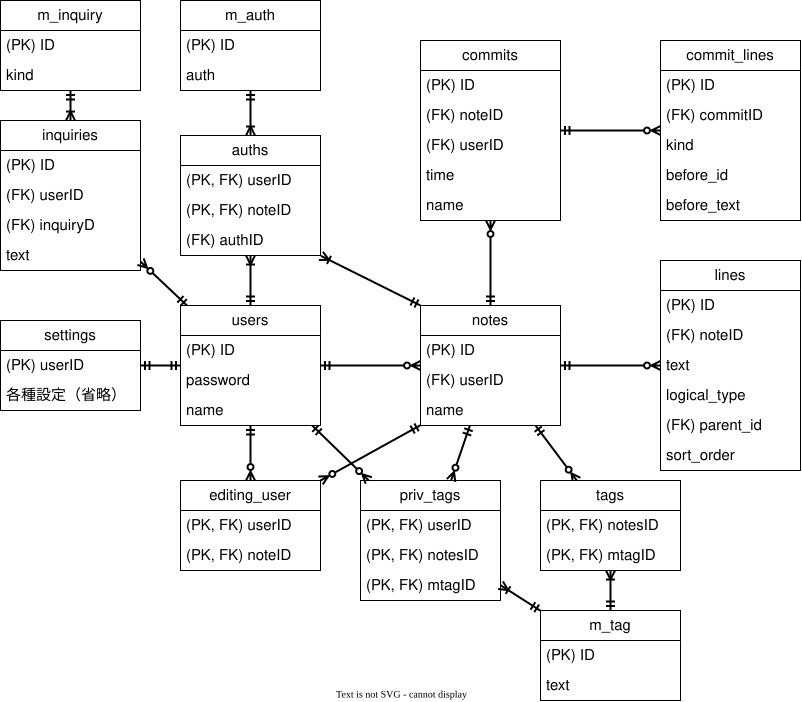

## 技術構成
### 言語
- Python
- JavaScript
### フレームワーク
- React
- TipTapというのが使えるらしい
### インフラ
- Docker
- Render
### データベース
- PostgreSQL
### 使用ライブラリ
- FastAPI

## 設計
### ディレクトリ構成
```text
ThinkTrace/
│
├── backend/          # Python, FastAPI
│   ├── app/              # APIを記述する部分
│   │   ├── feature/           # 各機能ごとの処理
│   │   │   ├── users/             # ユーザ自体に関する処理を記述する
│   │   │   │   ├── routes.py          # APIを受け取って対応する機能を呼び出す
│   │   │   │   ├── schemas.py         # APIのデータ受け渡し形式をクラスとして定義する
│   │   │   │   ├── deps.py            # 認証や認可を行う処理を依存関係としての形式に整える(必須ではない)
│   │   │   │   ├── service.py         # アプリの処理を記述する
│   │   │   │   ├── repository.py      # DBに対しての処理を記述する
│   │   │   │   ├── exceptions.py      # 発生しうるエラーを定義する
│   │   │   │   └── except_handler.py  # エラーの発生に応じた通信の内容を記述する
│   │   │   │
│   │   │   │   # ※ 以下にもusersと同様のファイルがあるが存在するが省略する
│   │   │   ├── auth/              # 認証などに関する処理を記述する
│   │   │   ├── memo/              # メモの編集に関する処理を記述する
│   │   │   └── trace/             # 履歴機能に関する処理を記述する
│   │   │
│   │   ├── core/           # あらゆる機能で共通する処理
│   │   │   ├── schemas/           # 上記のschemasと同様
│   │   │   │   └── error/                 # エラー時の通信におけるデータ受け渡し形式を定義する
│   │   │   │   └── security/              # セキュリティに関わる通信におけるデータ受け渡し形式を定義する
│   │   │   ├── database.py        # データベースとの接続を行う
│   │   │   ├── models.py          # DBに対してデータ受け渡し形式をクラスとして定義する
│   │   │   ├── config.py          # 機密情報等(.envファイル)を読み込んでまとめる
│   │   │   ├── security.py        # アプリの構造に依存しないセキュリティ関連の一般的な処理
│   │   │   └── responses.py       # HTTPレスポンスの文章などを再利用のためにまとめる
│   │   │
│   │   ├── main.py            # FastAPIの起動
│   │   └── __init__.py        # ここからがPythonのアプリ本体であることを示すマーカー
│   │
│   ├── tests/            # APIのテストを行う
│   │   ├── test_users.py
│   │   └── test_auth.py
│   │   ├── test_memo.py
│   │   └── test_trace.py
│   │
│   ├── requirements.txt
│   ├── .env              # 機密情報を記載する(Gitには上げない)
│   └── Dockerfile
│
├── frontend/         # React
│   ├── public/           # そのまま公開する画像やテキストなど
│   ├── src/              # Reactのファイル
│   │   ├── components/       # HTMLに載せる部品
│   │   ├── pages/            # 各ページの基本的なHTML
│   │   ├── hooks/            # フロント側の状態管理・React固有の処理
│   │   ├── services/         # FastAPIへの通信(axios)
│   │   ├── types/            # TypeScriptの型の記載
│   │   ├── App.tsx
│   │   └── main.tsx
│   │
│   ├── package.json
│   └── vite.config.ts
│
├── README.md
├── .gitignore
└── render.yaml（任意）
```

### アーキテクチャ
  <picture>
    <source media="(prefers-color-scheme: dark)" srcset="diagrams/architecture_dark.svg">
    <source media="(prefers-color-scheme: light)" srcset="diagrams/architecture_light.svg">
    
  </picture>

### ER図
  <picture>
    <source media="(prefers-color-scheme: dark)" srcset="diagrams/ERDiagram_dark.svg">
    <source media="(prefers-color-scheme: light)" srcset="diagrams/ERDiagram_light.svg">
    
  </picture>

※ 重要でない要素は除いています